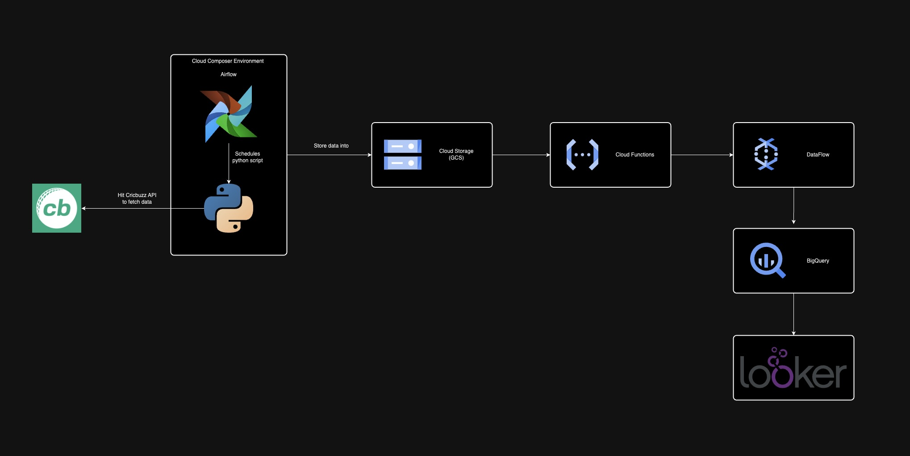

# Cricket-Data-Analysis-Pipeline
Building a cricket data analysis application leveraging Google Cloud Platform.

# Architecture

# Data Extraction & Storage
In the extract phase of this project, I have created a scheduled job using Airflow in a **Google Cloud Composer** environment. This triggers a python script (refer extract_stats.py), which fetches the statistics by hitting the cricbuzz API everyday. This data is extracted and stored by the same python script to the **Google Cloud Storage (GCS)**. The data is stored in a storage bucket in CSV format. This ensures scalability and accessibility for future processing.

--------

# Cloud Function Trigger
With the data stored in storage bucket, to further automate the pipeline, I have set up a cloud function that can be setup to run based on specific triggers. In this case, the trigger is: CSV file detection in a specific GCS bucket. Once the data file is uploaded there, this 'Cloud Function' (refer cloud_function.py) is triggered. Within this cloud function, the logic is written to trigger a specific job in **DataFlow**.

# Data Transfer to BigQuery
The DataFlow job triggered by the piece of code (refer to code_function.py) written in the 'Cloud Function', reads the data from the specified file in GCS bucket and inserts into a **BigQuery table**. For this DataFlow job to succeed, some things needs to be taken care of such as configuring the path of the file which resides in the GCS bucket, Schema of the table to be created in BigQuery, as well as a transformation function.

# Looker Dashboard
Since this is a platform specific process, no code is generated here. An important fact to note here is that the better we define the schemas for our data in BigQuery, the better options we have to visualize the data and relations between various attributes and tables by leveraging functions/tools in **Looker**. I am exploring various tools and techniques provided on the looker platform. It is a noteworthy fact that this platform by google can seemlessly integrate with data from various sources such as BigQuery(used in this project), Amazon Redshift, Google Ads, Analytics, etc. 
